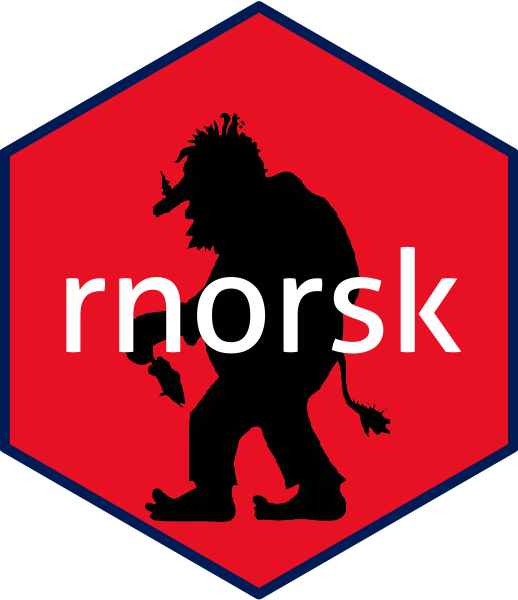

# rnorsk 

This packages is the companion package to our book "Statistiskk dataanalyse med R".

All datasets used in the book are included in this package. In addition, the package
contains several convenience functions that are used in the book.

## Installation

You can install the package from github using

``` r
#install.packages("devtools")
devtools::install_github("ihrke/rnorsk")
```

## Usage

In order to run the example codes from the book, you can use the following to install all 
packages used in the book.

``` r
library(rnorsk)
install.packages(rnorsk.all.used.packages)
```

